# PASO 1: Configurar DNS:

Para esto, lo haremos en base a la práctica realizada previamente sobre configurar un servidor DNS. Aquí se puede observar que el servidor funciona correctamente:

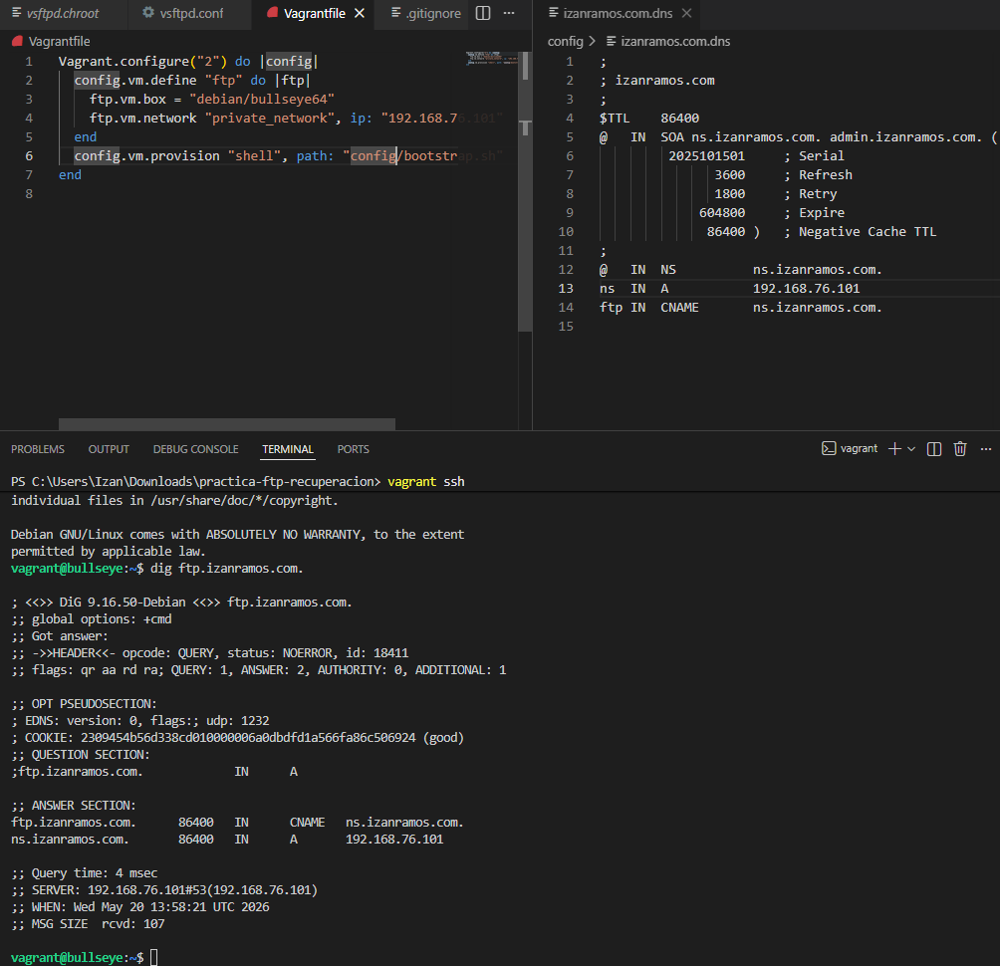

# PASO 2: Configurar el cliente gráfico

+ FileZilla instalado y posicionado en la carpeta pruebasFTP
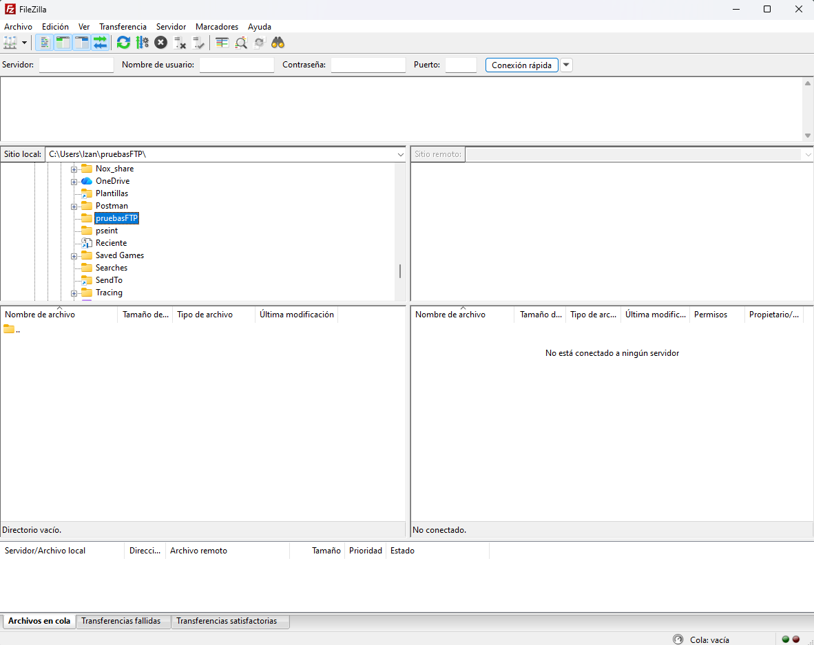

+ Realización de la conexión anónima a  ftp.cica.es correcta más descarga correcta de archivos
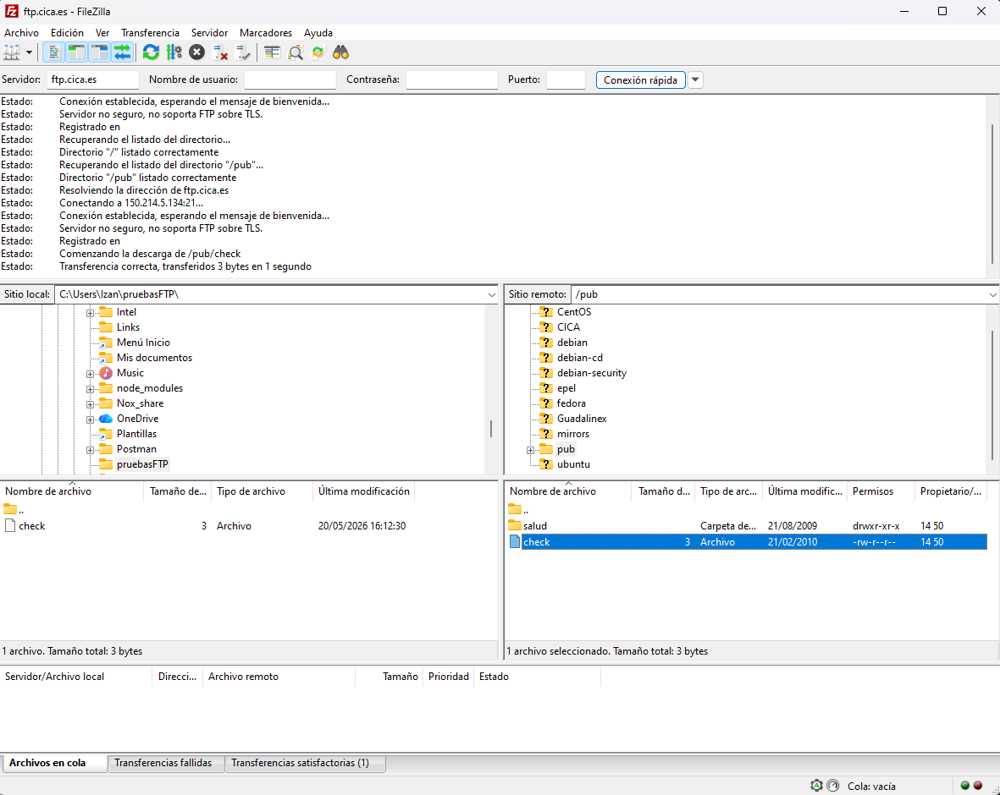

+ Intento de subida de archivos
Como se puede observar, no me deja subir el archivo de texto porque no tengo permisos
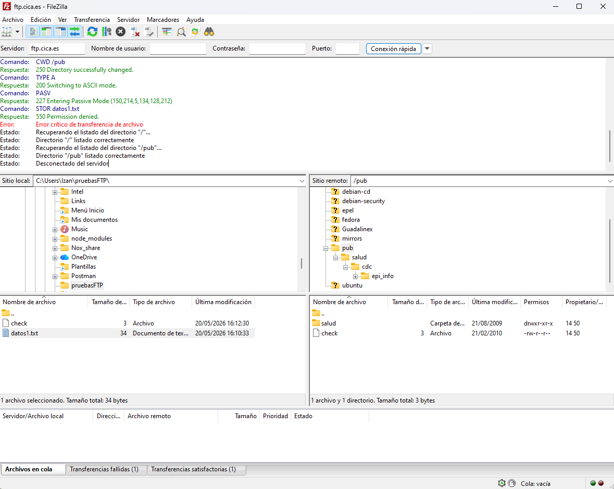

# PASO 3: Instalación y configuración del servidor "vsftpd" sobre Linux
Para ello, nos instalaremos el servicio **vsftpd** ejecutando `sudo apt-get install -y vsftpd`.

Después de instalar el servicio, podremos observar que se han creado un nuevo usuario y un nuevo grupo con el mismo nombre: ftp.
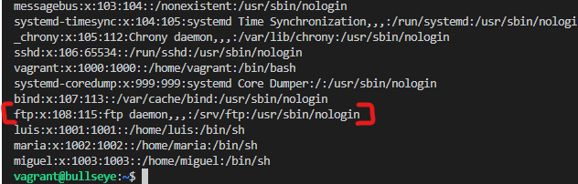 
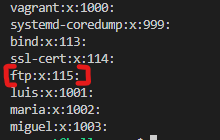

Además, también se crea la ruta "home" de FTP: 
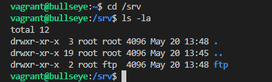

Los usuarios que no pueden usarse están en **/etc/ftpusers**: 
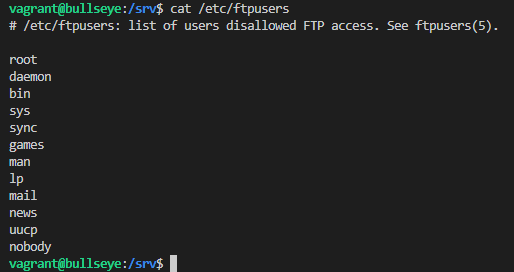

### Usuarios del servidor
Si ejecutamos `sudo service vsftpd status`, podremos observar que el servicio (o mejor dicho el servidor) está funcionando 
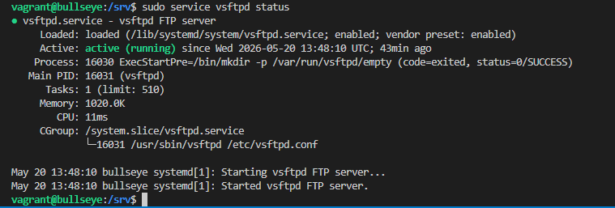

Y el puerto 21 está abierto: 
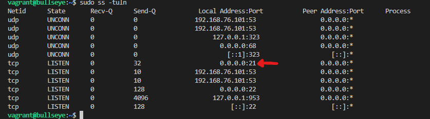

A continuación, creamos a los 3 usuarios que necesitamos (Luis, María y Miguel): 
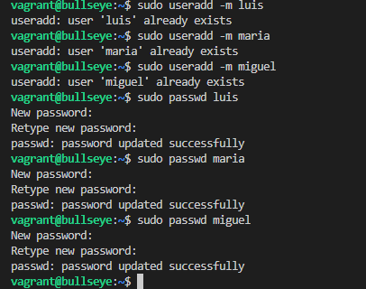 
(Hay que tener en cuenta que en la captura de pantalla pone que los usuarios ya existen porque los había creado previamente)

Antes de continuar con el siguiente apartado, haremos varias pruebas para comprobar que todo funciona bien:

+ Anónimo:
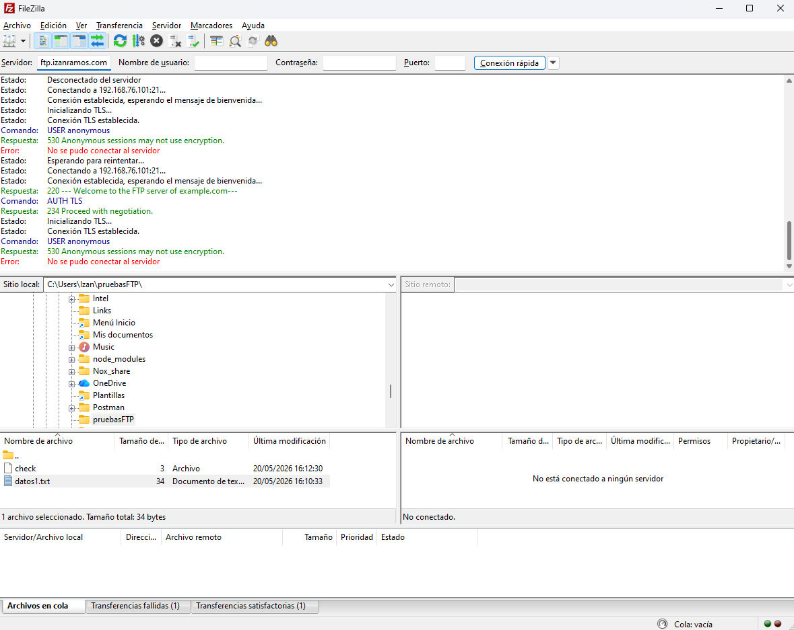

+ Luis: (Enjaulado)
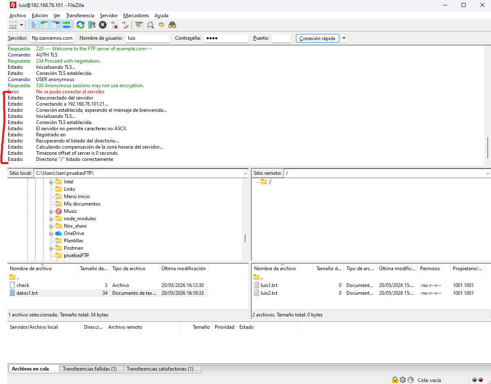

+ Miguel: (Enjaulado)
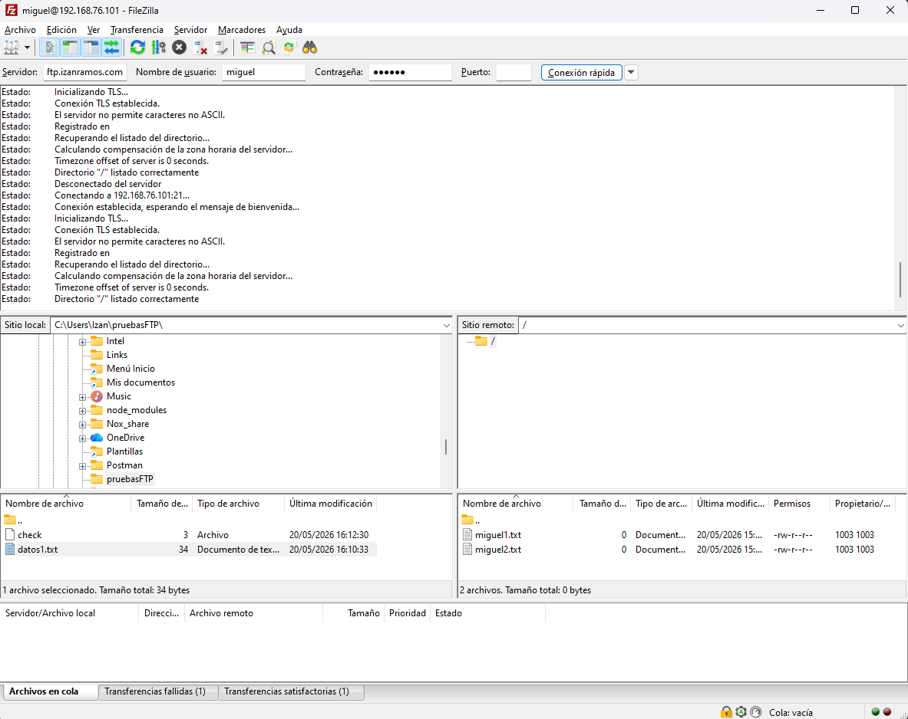

+ María: (No enjaulada)
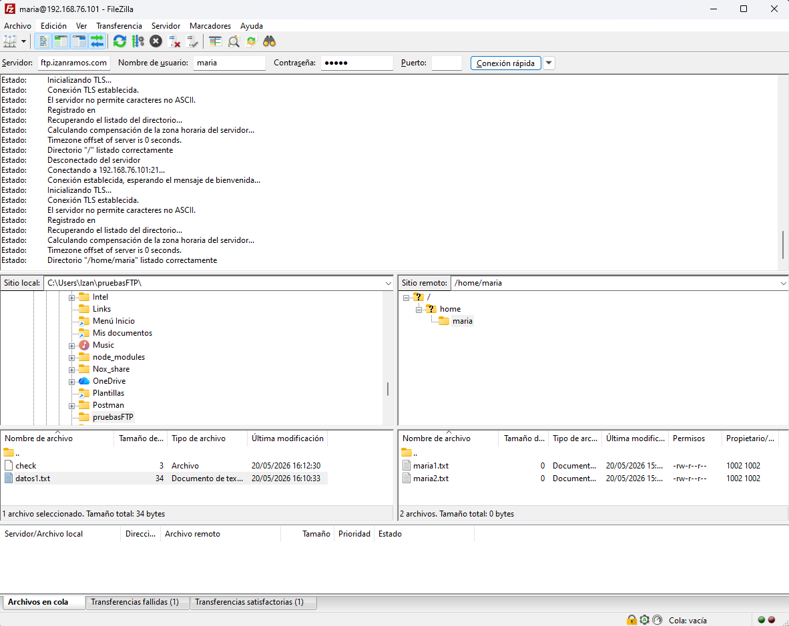

# PASO 4: Configuración del servidor vsftpd seguro

Generamos en /etc/ssl/certs el certificado ejecutando:

`sudo openssl req -x509 -nodes -days 365 -newkey rsa:2048 -keyout /etc/ssl/certs/izanramos.com.pem -out /etc/ssl/certs/izanramos.com.pem`  
